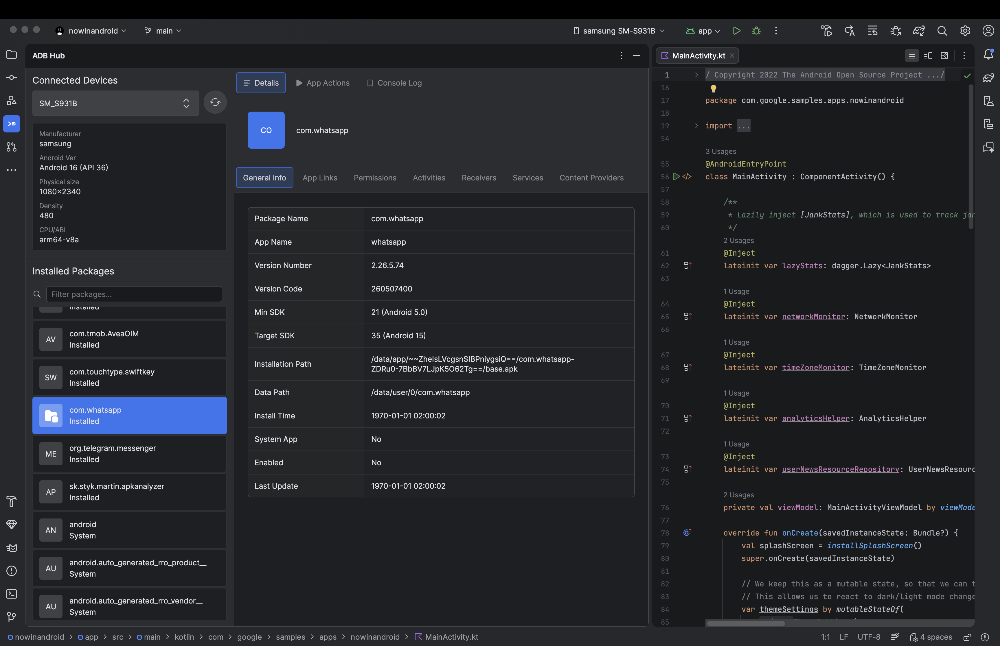
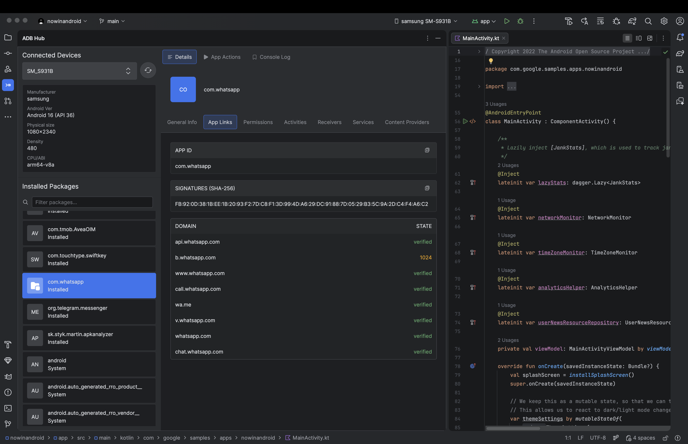
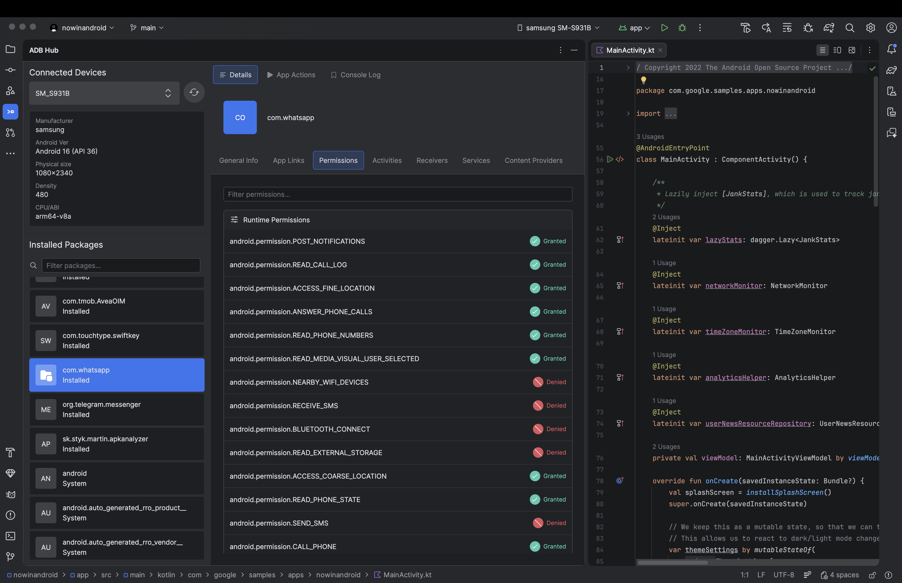
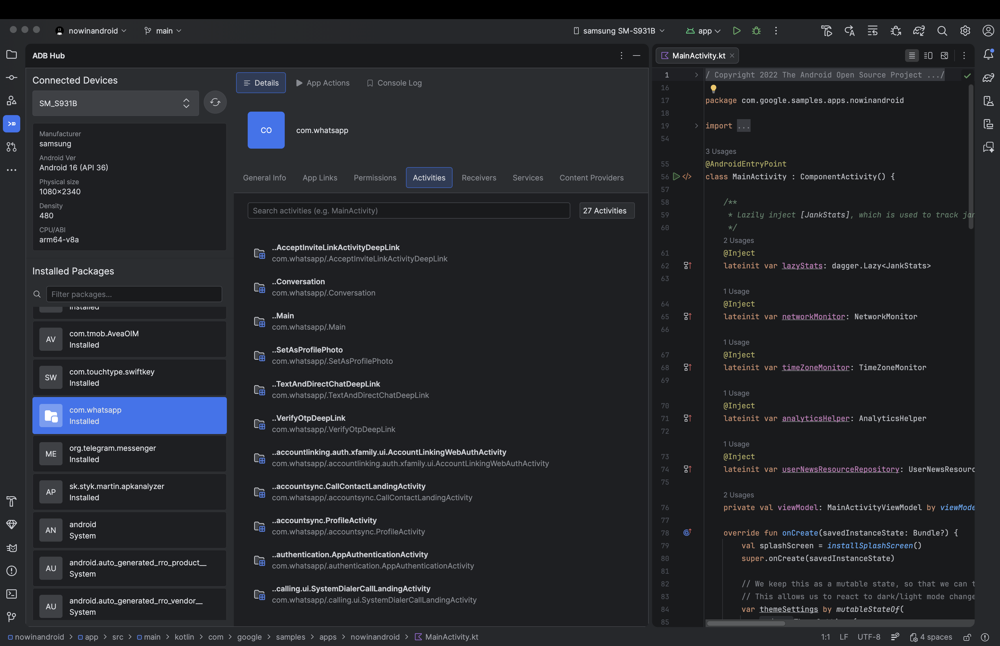
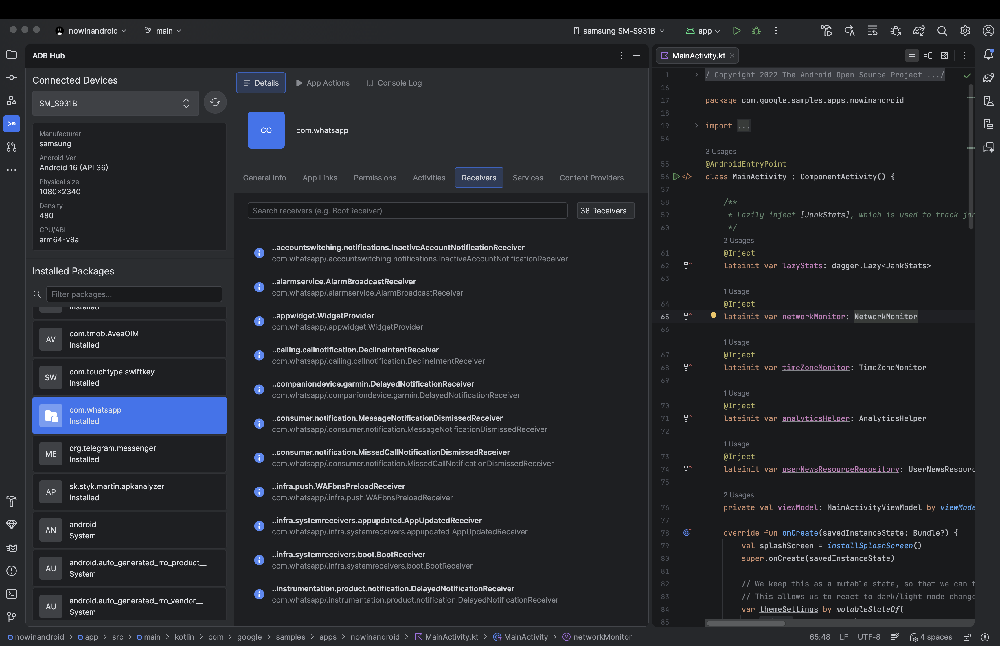
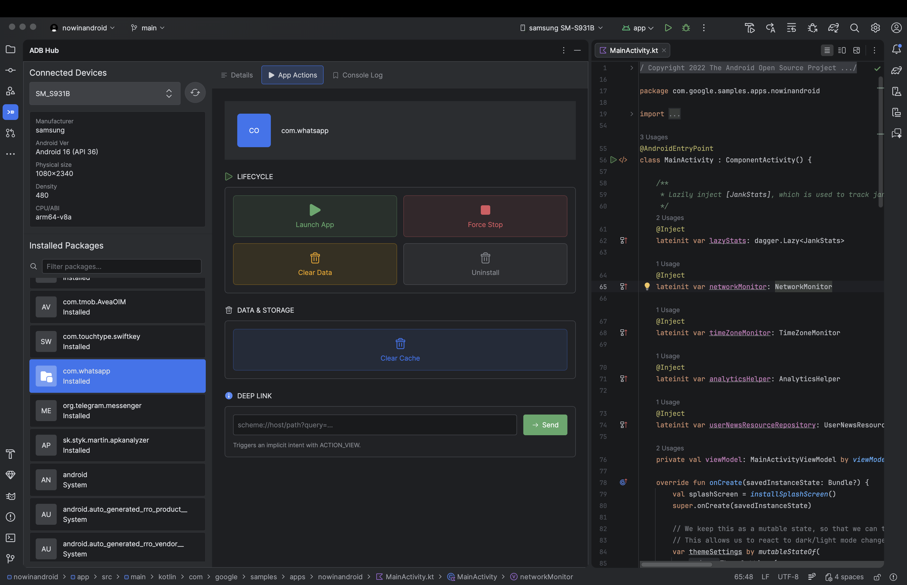
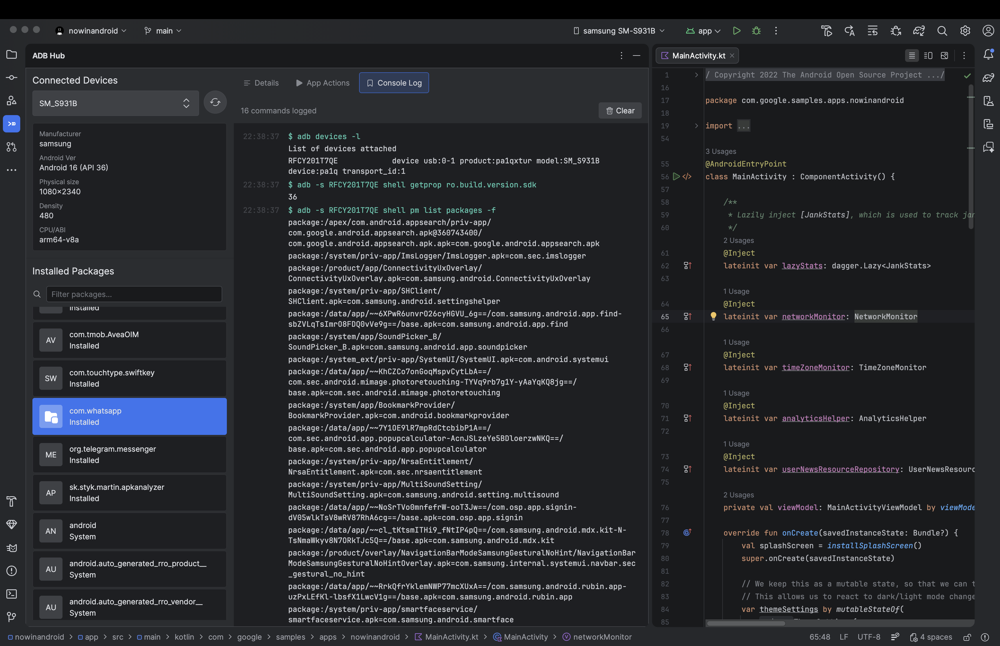

# ADB Hub

[][jb:marketplace]
[][license]

Manage Android devices and applications directly from your IDE—no terminal switching required.

## Features

### Device Management & Package Browser

- List USB and wireless connected devices, view device info (model, state, API level)
- Switch between multiple devices
- Browse installed apps with search and filter by package name
- View all packages including system apps

### Package Details

Inspect manifest components with dedicated tabs and search support:

| Tab | Description |
|-----|-------------|
| General Info | Version, package name, app name, install location, SDK versions |
| App Links | Intent filters and associated domains |
| Permissions | Declared permissions with search |
| Activities | Activities list with exported/enabled status |
| Services | Services list |
| Receivers | Broadcast receivers list |
| Content Providers | Content providers list |

### App Actions

Quick actions for installed applications:

- **Launch** – Start the app
- **Force stop** – Stop the running app
- **Clear data** – Wipe app data
- **Uninstall** – Remove the app
- **Clear cache** – Clear app cache
- **Send deep link** – Launch via implicit intent

### ADB Console

View the log of executed ADB commands in real time for debugging and transparency.

## Requirements

- [ADB](https://developer.android.com/tools/adb) installed and available in PATH (or configured in IDE settings)
- JetBrains AI 2025.2+, Android Studio, or IntelliJ IDEA

## Installation

1. Open **Settings/Preferences** → **Plugins** → **Marketplace**
2. Search for **ADB Hub** and click **Install**
3. Restart the IDE

## Usage

1. Open **View** → **Tool Windows** → **ADB Hub**
2. Connect an Android device via USB or wireless ADB
3. Select a device from the sidebar
4. Browse packages, inspect details, or run actions

## Technology Stack

- **Kotlin** – Primary language
- **Jetpack Compose (Jewel)** – UI framework
- **IntelliJ Platform** – Plugin SDK
- **Coroutines & Flow** – Async state management

## License

This project is licensed under the MIT License. See [LICENSE](LICENSE) for details.

[jb:marketplace]: https://plugins.jetbrains.com/search?search=ADB%20Hub
[license]: LICENSE

---

<!-- Plugin description -->
**ADB Hub** is an IntelliJ Platform plugin that helps Android developers manage connected devices and applications
without leaving the IDE.

## Features

- **Device management** – List and switch between USB/wireless connected devices, view device info
- **Package browser** – List installed apps with search, filter by package name
- **Package details** – Inspect manifest components: Activities, Services, Receivers, Content Providers, Permissions,
  App Links
- **Quick actions** – Launch, force stop, clear data, uninstall, clear cache, send deep links
- **ADB console** – View executed ADB commands in real time

<!-- Plugin description end -->
